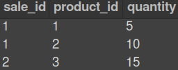

# Projeto Talker Manager

## Contexto

Este projeto é um sistema de gerenciamento de vendas no formato dropshipping em que será possível criar, visualizar, deletar e atualizar produtos e vendas.
<br />

<details>
  <summary><strong>👨‍💻 O que foi desenvolvido</strong></summary><br />

Foi desenvolvido uma API RESTful utilizando a arquitetura MSC (model-service-controller),

utilizando o banco de dados MySQL para a gestão de dados com os seguintes endpoints:

- endpoint GET /products
- endpoint GET /products/:id
- endpoint POST /products
- endpoint PUT /products/:id
- endpoint DELETE /products/:id
- endpoint GET products/search?q=searchTerm
- endpoint POST /sales
- endpoint GET /sales
- endpoint GET /sales/:id
- endpoint PUT /sales/:id
- endpoint DELETE /sales/:id

</details><br />

<details>
  <summary><strong>Habilidades</strong></summary><br />

O conjunto de operações conhecido como CRUD (Create, Read, Update e Delete) constituem a forma mais básica de manipular dados. Apesar disso, boa parte das aplicações de mercado giram em torno dessas quatro operações. Neste projeto, foi implementado essas operações utilizando Node.js e MySQL.
OS dados foram normalizados no momento de modelar o banco de dados. Além disso, foi implementado o padrão arquitetural MSC e os princípios do REST para construir o back-end.

</details><br />

## Executando aplicação

<details>
  <summary><strong>🐳 Rodando no Docker vs Localmente</strong></summary>

### 👉 Com Docker

**:warning: Antes de começar, seu docker-compose precisa estar na versão 1.29 ou superior. [Veja aqui](https://www.digitalocean.com/community/tutorials/how-to-install-and-use-docker-compose-on-ubuntu-20-04-pt) ou [na documentação](https://docs.docker.com/compose/install/) como instalá-lo. No primeiro artigo, você pode substituir onde está com `1.26.0` por `1.29.2`.**

> :information_source: Rode os serviços `node` e `db` com o comando `docker-compose up -d`.

- Lembre-se de parar o `mysql` se estiver usando localmente na porta padrão (`3306`), ou adapte, caso queria fazer uso da aplicação em containers;
- Esses serviços irão inicializar um container chamado `store_manager` e outro chamado `store_manager_db`;
- A partir daqui você pode rodar o container `store_manager` via CLI ou abri-lo no VS Code.

> :information_source: Opção 1: Use o comando `docker-compose run node npm test`, ou para acessar o container e executar lá:

> :information_source: Opção 2: Use o comando `docker exec -it store_manager bash` e sigas passos abaixo.

- Ele te dará acesso ao terminal interativo do container criado pelo compose, que está rodando em segundo plano.

> :information_source: Instale as dependências com `npm install`

- **:warning: Atenção:** Caso opte por utilizar o Docker, **TODOS** os comandos disponíveis no `package.json` (npm start, npm test, npm run dev, ...) devem ser executados **DENTRO** do container, ou seja, no terminal que aparece após a execução do comando `docker exec` citado acima.

- **:warning: Atenção:** Se você se deparar com erro de porta, quer dizer que sua aplicação já esta utilizando a `porta 3000`, seja com outro processo do Node.js (que você pode parar com o comando `killall node`) ou algum container! Neste caso você pode parar o container com o comando `docker stop <nome-do-container>`.

- ✨ **Dica:** Antes de iniciar qualquer coisa, observe os containers que estão em execução em sua máquina. Para ver os containers em execução basta usar o comando `docker container ls`, caso queira parar o container basta usar o comando `docker stop nomeContainer` e se quiser parar e excluir os containers, basta executar o comando `docker-compose down`

 <br />

### 👉 Sem Docker

> :information_source: Instale as dependências com `npm install`

- **:warning: Atenção:** Não rode o comando npm audit fix! Ele atualiza várias dependências do projeto, e essa atualização gera conflitos com o avaliador.

- **:warning: Atenção:** Não esqueça de configurar o arquivo `.env` para os testes locais funcionarem.
- **:warning: Atenção:** Para rodar o projeto desta forma, **obrigatoriamente** você deve ter o `Node.js` instalado em seu computador.
- **:warning: Atenção:** A versão do `Node.js` e `NPM` a ser utilizada é `"node": ">=16.0.0"` e `"npm": ">=7.0.0"`, como descrito a chave `engines` no arquivo `package.json`. Idealmente deve-se utilizar o Node.js na `versão 16.14`, a versão na que esse projeto foi testado.

  <br/>

</details>

<details>
  <summary id="diagrama-scripts"><strong>🎲 Diagrama ER, Entidades e Scripts</strong></summary>

#### Diagrama de Entidade-Relacionamento

Para orientar a manipulação das tabelas, foi utilizado o DER a seguir:


---

#### Tabelas

O banco tem três tabelas:

- A tabela `products`, com os atributos `id` e `name`;
- A tabela `sales`, com os atributos `id` e `date`;
- A tabela `sales_products`, com os atributos `sale_id`, `product_id` e `quantity`;
- O script de criação do banco de dados pode ser visto [aqui](migration.sql);
- O script que popula o banco de dados pode ser visto [aqui](seed.sql);

A tabela `products` tem o seguinte formato: _(O id é gerado automaticamente)_


A tabela `sales` tem o seguinte formato: _(O id e date são gerados automaticamente)_


A tabela `sales_products`, é a tabela que faz o relacionamento `N:N` entre `products` e `sales` e tem o seguinte formato: _(O produto e a venda são deletados automaticamente)_



---

#### Scripts prontos

- Criar o banco de dados e gerar as tabelas:

```sh
  npm run migration
```

- Limpar e popular o banco de dados:

```sh
  npm run seed
```

- Iniciar o servidor Node:

```sh
  npm start
```

- Iniciar o servidor Node com nodemon:

```sh
  npm run debug
```

- Executar os testes avaliativos da Trybe:

```sh
  npm test
```

- Executar os testes de unidade escritos por você:

```sh
  npm run test:mocha
```

- Executar o linter:

```sh
  npm run lint
```

  <br />
</details>

<details id="para-escrever-seus-próprios-arquivos-de-teste">
  <summary><strong>🔬 Testes de unidade</strong></summary><br />

- Foi utilizado o **mocha**, **chai** e **sinon** para escrever os testes;
- Todos os testes de `models`, `services` e `controllers` estão dentro da pasta `tests/unit`.
- **:warning: Atenção:** Os nomes dos arquivos de testes seguiram essa estrutura `nomeDoArquivo.test.js`
- **✨ Dica:** Como os arquivos dos teste de unidade foram criados:

```tree
.
├─ ...
├─ src
├─ tests
│   └─ unit
|       ├─ controllers
│           ├─ productsControllers.test.js
│           └─ salesControllers.test.js
|       ├─ services
│           ├─ productsServices.test.js
│           └─ salesServices.test.js
|       └─ models
│           ├─ productsModels.test.js
│           └─ salesModels.test.js
└─ ...
```

  <br />

</details>